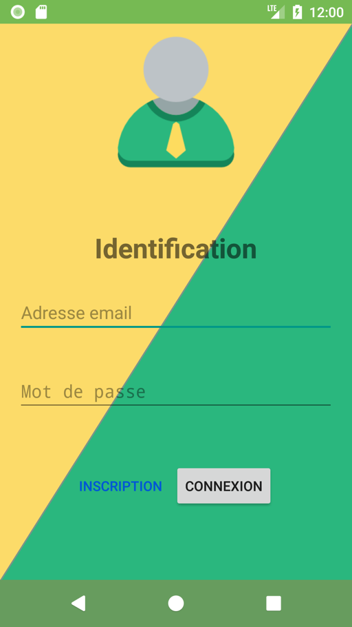

# Android Project 🤖
This is my first project in _Android_.
It has been developped in my third year at the Haute École en Hainaut for the _Développement mobile - Applications sur Android_ course.

The code is in the [code/app/src/main/java/be/heh](code/app/src/main/java/be/heh) folder.  
And the report will be soon [here](https://github.com/Harchytekt/Rapports/blob/master/2015-2018%20(HeH)/2017-2018/Applications%20sur%20Android/Rapport.pdf).

## The project 👨🏻‍💻

It involves the supervision and remote control of two industrial processes:
- Packaging of tablets, controlled by the PLC S7-1516 2DPPN automaton.
- Liquid level control, controlled by the PLC S7-1214C automaton.

## The design 👨🏻‍🎨

It will therefore be necessary to design a visual and neat interface (to display the input and output information "machine" and this, in a clear and textual or pictorial way,…).
But also to be able to modify this information at the beginning of the text box.

We have carte blanche as for the presentation of the interface: **Material Design** + **layout**!

## The users 👨‍👩‍👧‍👦

It is necessary to provide user management.  
Read or read/write rights will not be set to all users!

Every user is registered with the "**Basic**" profile and has the right to read.
A user is represented by his name, firstname and email address as well as a password. It connects via its login: email address and password (minimum 4 characters).

The user privilege options _(R or R/W)_ are accessible via the login and password of the "**Super user**" login: "android" and (modifiable) password: "android3".

